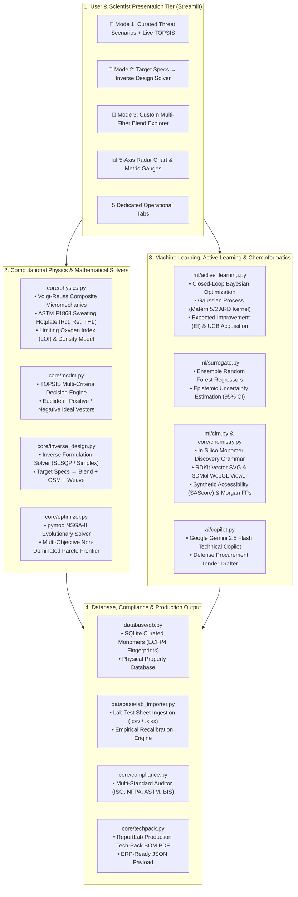

<div align="center">

# 🔬 AIMATRY (AAK-AI)
### Enterprise Materials Informatics & Generative Polymer Designer for High-Performance Protective Technical Textiles

[](https://aak-ai-nitra.streamlit.app)
[](https://github.com/ayushhcodex/aak-ai)
[](https://www.python.org/)
[](https://opensource.org/licenses/MIT)

[](https://www.rdkit.org/)
[](https://pymoo.org/)
[](https://scikit-learn.org/)
[](https://www.reportlab.com/)
[](https://ai.google.dev/)
[](https://nitra.ac.in/)

<p align="center">
  <b>An end-to-end computational materials informatics platform that accelerates the discovery, inverse formulation, optimization, compliance verification, and industrialization of protective technical textiles and high-performance polymers.</b>
</p>

<p align="center">
  <a href="https://aak-ai-nitra.streamlit.app"><b>🌐 Launch Live Web Platform</b></a> •
  <a href="#-key-features--capabilities"><b>✨ Key Features</b></a> •
  <a href="#-system-architecture"><b>🏗️ System Architecture</b></a> •
  <a href="#-scientific-and-mathematical-foundation"><b>📐 Scientific Math</b></a> •
  <a href="#-installation--quickstart"><b>🚀 Quickstart</b></a> •
  <a href="#-programmatic-python-api"><b>💻 Python API</b></a> •
  <a href="#-documentation-hub"><b>📚 Documentation</b></a>
</p>

</div>

---

> **Institutional Attribution**:  
> **Department of Computer Science & Engineering (CSE) & Textile Technology**  
> **NITRA Technical Campus** *(Academic Wing of Northern India Textile Research Association, Ministry of Textiles, Govt. of India)*, Ghaziabad, UP, India  
> **Lead Researchers / Developers**: Ayush Singh, Vansh Mishra, Nikhil Kumar Yadav  
> **Domain Focus**: Protective Technical Textiles, Ballistics, Firefighting Gear, High-Altitude & Space Ensembles, CBRN Defense, Flame-Retardant Polymers

---

## 📑 Table of Contents

- [🌟 Executive Summary & The Problem](#-executive-summary--the-problem)
- [✨ Key Features & Capabilities](#-key-features--capabilities)
- [🏗️ System Architecture & Workflow Pipeline](#-system-architecture--workflow-pipeline)
- [🖥️ Interactive UI: The 5 Operational Modules](#-interactive-ui-the-5-operational-modules)
- [🎯 Pre-Configured Threat Scenarios](#-pre-configured-threat-scenarios)
- [📐 Scientific and Mathematical Foundation](#-scientific-and-mathematical-foundation)
  - [1. Physics-Based Micromechanics & Transport Model](#1-physics-based-micromechanics--thermal-transport-model)
  - [2. Multi-Criteria Decision Analysis (TOPSIS)](#2-multi-criteria-decision-analysis-topsis)
  - [3. Target Specs → Inverse Material Formulation Solver](#3-target-specs--inverse-material-formulation-solver)
  - [4. Closed-Loop Active Learning & Bayesian Optimization](#4-closed-loop-active-learning--bayesian-optimization)
  - [5. Generative In Silico Monomer Discovery & SAScore](#5-generative-in-silico-monomer-discovery--sascore)
  - [6. Machine Learning Surrogates with Epistemic Uncertainty](#6-machine-learning-surrogates-with-epistemic-uncertainty)
  - [7. Automated Regulatory Standards Pre-Compliance Auditor](#7-automated-regulatory-standards-pre-compliance-auditor)
  - [8. Industrial Tech-Pack & BOM PDF Generator](#8-industrial-tech-pack--bom-pdf-generator)
  - [9. Technical AI Copilot & Defense Procurement Drafter](#9-technical-ai-copilot--defense-procurement-drafter)
  - [10. Empirical Laboratory Calibration Ingestion](#10-empirical-laboratory-calibration-ingestion)
- [📜 Supported Standards & Regulatory Compliance](#-supported-standards--regulatory-compliance)
- [📂 Repository Structure](#-repository-structure)
- [🚀 Installation & Quickstart](#-installation--quickstart)
- [💻 Programmatic Python API](#-programmatic-python-api)
- [🧪 Automated Test Suite](#-automated-test-suite)
- [🐳 Docker & Cloud Deployment](#-docker--cloud-deployment)
- [📚 Documentation Hub](#-documentation-hub)
- [📜 Citation & Institutional Attribution](#-citation--institutional-attribution)

---

## 🌟 Executive Summary & The Problem

Developing advanced protective technical textiles for extreme environments (firefighting turnout gear, ballistic body armor, lunar space suits, CBRN protection, molten metal splash shields) is traditionally an **empirical, slow, and cost-prohibitive** process:

| Traditional Physical R&D Workflow | AIMATRY (AAK-AI) Computational Platform |
|:---|:---|
| ⏳ **18 to 36 months** trial-and-error cycle time | ⚡ **Real-time forward simulation & inverse optimization** (< 1 sec) |
| 💸 Tens of thousands of dollars spent on destructive testing | 📉 **80% reduction** in physical laboratory coupon iterations |
| 🔬 Heuristic blending based on historical bias | 🎯 **Target Specs $\to$ Exact Fiber Blends & Weaves** via SLSQP |
| 🚫 Slow synthesis of novel monomers without accessibility checks | 🧬 **In silico polymer discovery** with automated SAScore validation |
| 📄 Manual compliance paperwork and specification drafting | 📜 **Instant automated multi-standard audit + 1-click Tech-Pack PDF** |

**AIMATRY (AAK-AI)** bridges **Computer Science, Applied Mathematics, and Polymer/Textile Engineering** to deliver a unified materials informatics ecosystem that replaces experimental guesswork with rigorous computational intelligence.

---

## ✨ Key Features & Capabilities

- 🔬 **Forward Physics Micromechanics & Transport Modeling**:
  Calculates composite tensile modulus, density, Limiting Oxygen Index ($\text{LOI}$), thermal resistance ($R_{ct}$), evaporative water-vapour resistance ($R_{et}$), and Sweating Guarded Hotplate Total Heat Loss ($\text{THL}$ in $\text{W/m}^2$) per **ASTM F1868** and **ISO 11092**.
- 🎯 **Target Specifications $\to$ Inverse Material Design**:
  Enter your desired performance targets (minimum HTP, target THL, tensile strength, LOI, and maximum budget in ₹/$\text{m}^2$). The SLSQP constrained solver computes the optimal fiber blend ratios, fabric areal weight ($\text{GSM}$), and weave structure.
- 🧪 **Closed-Loop Active Learning (Bayesian Optimization)**:
  Uses a Gaussian Process Regressor with a **Matérn 5/2 ARD kernel** and **Expected Improvement (EI) / Upper Confidence Bound (UCB)** acquisition functions to recommend the exact next experimental coupon to synthesize in the laboratory.
- 🧬 **Generative Chemistry & Monomer Discovery**:
  Algorithmic generation of flame-retardant, high-temperature aromatic polymer monomers using RDKit, featuring synthetic accessibility scoring (**SAScore**), 512-bit Morgan fingerprints (ECFP4), 2D vector SVG diagrams, and interactive 3DMol WebGL viewing.
- 📊 **Multi-Criteria TOPSIS & Multi-Objective NSGA-II Pareto Solver**:
  Rank formulations via the Technique for Order Preference by Similarity to Ideal Solution (TOPSIS) or explore true 4-objective non-dominated Pareto trade-offs using genetic algorithms (`pymoo`).
- 📜 **Automated Regulatory Pre-Compliance Auditor**:
  Instant deterministic verification against **ISO 11612:2015**, **NFPA 1971 (2018)**, **ASTM F1959 / NFPA 70E Arc Flash**, **BIS IS 15742:2007**, **BIS IS 14324 / NIJ 0101.06**, and **EN ISO 11092**.
- 📑 **Industrial Manufacturing Tech-Pack & BOM PDF Generator**:
  Two-pass vector PDF engine (ReportLab) generating production-ready specification dossiers with dynamic `"Page X of Y"` numbering, complete Bill of Materials (BOM), 5-year thermal durability curves, spinning/weaving parameters, and ERP-ready JSON export.
- 💬 **Domain-Grounded Technical AI Copilot**:
  Integrated with **Google Gemini 2.5 Flash** to provide scientific reasoning, thermal degradation thermodynamics, and automated defense procurement tender drafting (DRDO / DGQA / MHA / Make-in-India bids) with a deterministic offline fallback.
- 📈 **Empirical Laboratory Calibration Ingestion**:
  Upload CSV/XLSX test sheets from Instron tensile testers or sweating hotplates to automatically compute machine-specific calibration offsets ($\kappa$) and refine physics equations.

---

## 🏗️ System Architecture & Workflow Pipeline

AIMATRY is built with a decoupled, modular multi-tier architecture:



---

## 🖥️ Interactive UI: The 5 Operational Modules

| Module | Purpose & User Capabilities | Key Output Artifacts |
|:---|:---|:---|
| **🔬 Module 1: Material Designer & Simulator** | Interactive multi-fiber ratio sliders (Para-aramid, Meta-aramid, PBI, Modacrylic, etc.), GSM and weave selector, live 5-axis Plotly radar chart, and Target Specs Inverse Design solver. | Real-time mechanical/thermal properties, Radar chart, Inverse formulation recommendations |
| **🧪 Module 2: Laboratory & Active Learning** | Gaussian Process Bayesian Optimization to plan physical coupon trials with EI/UCB strategies; accredited lab test sheet CSV ingestion with empirical physics recalibration. | Downloadable Lab Batch Card (CSV), Fitted empirical scaling coefficients ($\kappa$) |
| **🧬 Module 3: Generative Chemistry & Monomers** | In silico flame-retardant monomer discovery with aromatic cores and reactive groups; 2D vector SVG display, SAScore filter ($< 4.5$), and curated SQLite monomer browser. | Molecular SMILES, SAScore ratings, 2D vector SVGs, 3DMol WebGL models, Morgan fingerprints |
| **📜 Module 4: Regulatory Standards & Tech-Pack** | Deterministic pre-compliance matrix checking against ISO, NFPA, ASTM, and BIS standards; electric arc flash rating; 1-click Industrial Tech-Pack BOM PDF generation. | Multi-standard compliance audit table, Two-pass industrial Tech-Pack PDF, ERP JSON payload |
| **📊 Module 5: ML Surrogates & Deep Analytics** | Ensemble Random Forest surrogate predictions with 95% Confidence Intervals, pymoo NSGA-II 4-objective Pareto scatter plot, and Google Gemini 2.5 Flash technical copilot. | Epistemic uncertainty bounds, Interactive Pareto frontier, Generated defense procurement bid text |

---

## 🎯 Pre-Configured Threat Scenarios

AIMATRY comes pre-loaded with **10 rigorously researched threat scenarios** representing cutting-edge industrial, space, and defense applications:

| # | Threat Scenario | Primary Base Formulation | Target Performance Highlight | Benchmark Standard |
|:-:|:---|:---|:---|:---|
| 1 | **Extreme Cold Weather** | Meta-aramid (80%) + Silica Aerogel (20%) | Extreme thermal barrier ($R_{ct} > 0.055\text{ m}^2\text{K/W}$) with breathability | ECWCS Gen III Level 7 |
| 2 | **Ballistic Impact** | Para-aramid (90%) + Carbon Fiber (10%) | Ultra-high tensile breaking strength ($\sigma > 2.8\text{ GPa}$) & shear resistance | NIJ Level IIIA Kevlar |
| 3 | **Lunar Operations** | Polyimide Kapton (75%) + Silica Aerogel (25%) | Radiation shielding, extreme thermal stability ($-180^\circ\text{C}$ to $+120^\circ\text{C}$) | NASA EMU Extravehicular Suit |
| 4 | **Deep Ocean Dive** | UHMWPE Dyneema (85%) + Carbon Fiber (15%) | Hydrostatic pressure resistance with neutral buoyancy | Ultra-High Modulus PE |
| 5 | **Chemical Spill (HAZMAT)** | PTFE Fluoropolymer (80%) + Meta-aramid (20%) | Total chemical impermeability against industrial toxins & acids | DuPont Tychem 10000 |
| 6 | **Arc Flash & High Voltage** | Modacrylic (60%) + Para-aramid (40%) | High Arc Rating ($\text{ATPV} > 25\text{ cal/cm}^2$, PPE Category 3/4) | NFPA 70E PPE Cat 4 |
| 7 | **Wildland Firefighting** | Meta-aramid (65%) + Modacrylic (35%) | Enhanced thermo-physiological comfort ($\text{THL} > 280\text{ W/m}^2$) | NFPA 1977 Wildland Gear |
| 8 | **High-Altitude Aviation** | Polyimide P84 (70%) + Para-aramid (30%) | High strength-to-weight ratio with non-melting flame resistance | MIL-C-83429 Flight Suit |
| 9 | **CBRN Defense (Tactical)** | Activated Carbon Fabric + Nomex (60/40) | Chemical and aerosol agent adsorption with low moisture burden | NATO AEP-38 CBRN Spec |
| 10 | **Molten Metal Splash** | Basalt Fiber (60%) + PBI (40%) | Non-stick surface repulsion against molten iron/aluminum ($1400^\circ\text{C}$) | ISO 11612 Code D3/E3 |

---

## 📐 Scientific and Mathematical Foundation

### 1. Physics-Based Micromechanics & Thermal Transport Model
Computes macro-level mechanical and thermo-physiological properties from individual constituent fibers, areal density ($\text{GSM}$), and weave architecture:

- **Composite Density ($\rho_c$)**: Calculated via the Voigt Rule of Mixtures:
  $$\rho_c = \sum_{i=1}^{n} w_i \cdot \rho_i$$
- **Volume Fractions ($V_i$)**: Derived from mass fractions $w_i$ and constituent densities:
  $$V_i = \frac{w_i / \rho_i}{\sum_{j=1}^{n} (w_j / \rho_j)}$$
- **Tensile Modulus ($E_c$) & Breaking Strength ($\sigma_c$)**:
  $$E_c = \gamma_{\text{weave}} \cdot \sum_{i=1}^{n} V_i \cdot E_i, \quad \sigma_c = \gamma_{\text{weave}} \cdot \sum_{i=1}^{n} V_i \cdot \sigma_i$$
- **Limiting Oxygen Index ($\text{LOI}_c$)**:
  $$\text{LOI}_c = \sum_{i=1}^{n} w_i \cdot \text{LOI}_i$$
- **Thermal Resistance ($R_{ct}$)**:
  $$R_{ct} = \frac{t_c}{k_c} = \frac{\text{GSM} / (\rho_c \cdot 10^3)}{\sum w_i k_i} \quad [\text{m}^2\text{K/W}]$$
- **Sweating Guarded Hotplate Total Heat Loss ($\text{THL}$)** (ASTM F1868 / ISO 11092):
  $$\text{THL} = \frac{T_{\text{skin}} - T_{\text{amb}}}{R_{ct} + R_{ct,0}} + \frac{P_{\text{skin}} - P_{\text{amb}}}{R_{et} + R_{et,0}} \quad [\text{W/m}^2]$$
  *(Standardized at $T_{\text{skin}} = 35^\circ\text{C}, T_{\text{amb}} = 25^\circ\text{C}, P_{\text{skin}} = 5.62\text{ kPa}, P_{\text{amb}} = 2.06\text{ kPa}$)*.

---

### 2. Multi-Criteria Decision Analysis (TOPSIS)
Ranks candidate formulations using the **Technique for Order Preference by Similarity to Ideal Solution (TOPSIS)**:
1. Normalizes the multi-criteria evaluation matrix across HTP, THL, Tensile Strength, Flexibility, and Manufacturability.
2. Applies user-configured criteria weights $W = [w_1, w_2, \dots, w_m]$ with $\sum w_j = 1$.
3. Identifies the Positive-Ideal Solution ($A^*$) and Negative-Ideal Solution ($A^-$).
4. Calculates Euclidean geometric distances $S_i^*$ and $S_i^-$:
   $$S_i^* = \sqrt{\sum_{j=1}^{m} (v_{ij} - v_j^*)^2}, \quad S_i^- = \sqrt{\sum_{j=1}^{m} (v_{ij} - v_j^-)^2}$$
5. Generates the final performance score via Relative Closeness $C_i^* = \frac{S_i^-}{S_i^* + S_i^-} \in [0, 1]$.

---

### 3. Target Specs → Inverse Material Formulation Solver
Reverse-engineers the exact fiber blend composition, required fabric areal density ($\text{GSM}$), and weave geometry directly from desired target performance metrics:
- Solves a constrained nonlinear optimization problem using SLSQP over the probability simplex $\sum w_i = 1, w_i \ge 0$.
- Penalizes deficits in user-defined target thresholds:
  $$\mathcal{L}(w, \text{GSM}) = \sum_{k} \lambda_k \cdot \max(0, \text{Target}_k - \text{Achieved}_k)^2 + \beta \cdot \text{Cost} + \mu \cdot (100 - \text{Manufacturability})$$
- Automatically enforces manufacturing feasibility and budget boundaries (INR/$\text{m}^2$).

---

### 4. Closed-Loop Active Learning & Bayesian Optimization
Guides laboratory scientists to fabricate the most informative experimental coupons next, minimizing physical prototyping cycles:
- Employs a **Gaussian Process Regressor** with a **Matérn 5/2 Anisotropic Automatic Relevance Determination (ARD) Kernel** combined with a **WhiteNoise Kernel**:
  $$k(x, x') = \sigma_f^2 \left(1 + \sqrt{5}r + \frac{5}{3}r^2\right) \exp(-\sqrt{5}r) + \sigma_n^2 \delta(x, x')$$
- Implements two acquisition strategies:
  1. **Expected Improvement (EI)**:
     $$\text{EI}(x) = (\mu(x) - f^* - \xi)\Phi(Z) + \sigma(x)\phi(Z), \quad Z = \frac{\mu(x) - f^* - \xi}{\sigma(x)}$$
  2. **Upper Confidence Bound (UCB)**:
     $$\text{UCB}(x) = \mu(x) + \kappa \cdot \sigma(x)$$
- Generates downloadable **Lab Batch Cards (CSV)** for immediate factory floor or laboratory sample production.

---

### 5. Generative In Silico Monomer Discovery & SAScore
- **In Silico Chemical Grammar**: Algorithmic generation of novel monomers by coupling high-performance aromatic cores (1,4-Phenylene, 4,4'-Biphenylene, Benzoxazole, Benzimidazole, Phosphine Oxide) with reactive functional heads (Diamines, Diacyl Chlorides, Dicarboxylic Acids, Bisphenols, Dicyanates).
- **Flame-Retardant Functionalization**: Automatic substitution of synergistic char-promoting side chains (Diethyl Phosphonate, Trifluoromethyl, Sulfonamide, Nitrile).
- **Synthetic Accessibility Score (SAScore)**: Computes Ertl & Schuffenhauer SAScore (1.0 = highly accessible, 10.0 = virtually impossible) by combining fragment library contributions with non-linear molecular complexity penalties.
- **2D Vector SVG Rendering**: Generates crisp, dark-mode-optimized chemical structure diagrams using RDKit's SVG canvas backend.
- **Similarity Search**: Evaluates 512-bit Morgan Fingerprints (ECFP4) using the Tanimoto coefficient against commercial monomers.

---

### 6. Machine Learning Surrogates with Epistemic Uncertainty
- Fast ensemble **Random Forest Regressors** trained over continuous multi-fiber composition spaces.
- Computes **Epistemic Uncertainty** and empirical **95% Confidence Intervals** ($[\mu - 1.96\sigma, \mu + 1.96\sigma]$) across all predicted properties (Tensile Strength, LOI, $R_{ct}$, $R_{et}$, $\text{THL}$).
- Performs **Feature Permutation Sensitivity Analysis** to identify which fiber constituent dominates a given physical response.

---

### 7. Automated Regulatory Standards Pre-Compliance Auditor
Performs deterministic, rule-based auditing against international and Indian defense testing standards:
- **ISO 11612:2015**: Convective heat transmission index ($\text{HTI}_{24}$) levels B1, B2, B3 and flame spread code A1/A2.
- **NFPA 1971 (2018 Ed.)**: Structural firefighting turnout gear ($\text{TPP} \ge 35.0\text{ cal/cm}^2$, $\text{THL} \ge 205.0\text{ W/m}^2$, char length $< 100\text{ mm}$).
- **ASTM F1959 / NFPA 70E**: Arc Thermal Performance Value ($\text{ATPV}$) Category 1 through 4 electrical arc flash ratings.
- **BIS IS 15742:2007**: Indian national standard for protective clothing against heat and flame.
- **BIS IS 14324 / NIJ 0101.06**: Ballistic body armor threat levels (Level IIA, II, IIIA, III, IV).
- **EN ISO 11092 / EN 343**: Physiological breathability classifications (Class 1 to Class 4).

---

### 8. Industrial Tech-Pack & BOM PDF Generator
Generates comprehensive, publication-grade Technical Specification Packs and Bills of Materials (BOM) exportable as **PDF documents** (via ReportLab) or **JSON payloads**:
- Yarn spinning parameters (recommended English Cotton Count $\text{Ne}$ and Denier).
- Weave architecture (Plain, Twill, Satin, Ripstop, Auxetic, 3D Orthogonal) with ends/picks per inch.
- Finishing & surface chemical recipes (DWR fluoropolymer, intumescent coatings, STF nano-colloidal suspensions).
- Estimated factory production costing in both Indian Rupees (₹/$\text{m}^2$) and US Dollars (\$/$\text{m}^2$).
- Lifecycle Analysis (LCA) Carbon footprint ($\text{kg CO}_2\text{/kg}$) and water consumption ($\text{L/kg}$).

---

### 9. Technical AI Copilot & Defense Procurement Drafter
- Integrated with **Google Gemini 2.5 Flash** (`google-genai` SDK) using structured prompt grounding with current formulation state, physical properties, and compliance status.
- **Defense Procurement Drafting**: Automatically drafts complete Technical Bids and Make-in-India justification proposals for DRDO, DGQA, MHA, and Indian Ministry of Defence procurement tenders.
- **Graceful Offline Fallback**: Features a fully deterministic, offline scientific reasoning fallback when no API key or internet connection is present.

---

### 10. Empirical Laboratory Calibration Ingestion
- Ingests raw CSV/Excel test sheets from laboratory testing equipment (Instron tensile testers, sweating hotplates, LOI chambers).
- Automatically recalibrates theoretical micromechanical equations using empirical scaling factors:
  $$\kappa_{\text{THL}} = \frac{1}{N}\sum \frac{\text{Measured THL}}{\text{Simulated THL}}, \quad \kappa_{\text{LOI}} = \frac{1}{N}\sum \frac{\text{Measured LOI}}{\text{Simulated LOI}}, \quad \kappa_{\text{Tensile}} = \frac{1}{N}\sum \frac{\text{Measured Tensile}}{\text{Simulated Tensile}}$$

---

## 📜 Supported Standards & Regulatory Compliance

| Standard Code | Issuing Body | Domain & Scope | Primary Audited Thresholds |
|:---|:---|:---|:---|
| **ISO 11612:2015** | ISO (International) | Protective clothing against heat and flame | Convective heat index ($\text{HTI}_{24}$ Levels B1–B3), radiant heat |
| **NFPA 1971 (2018)** | NFPA (USA) | Structural & proximity firefighting turnout gear | $\text{TPP} \ge 35.0\text{ cal/cm}^2$, $\text{THL} \ge 205.0\text{ W/m}^2$, char length $< 100\text{ mm}$ |
| **ASTM F1959 / NFPA 70E** | ASTM / NFPA | Electrical arc thermal performance | Arc Thermal Performance Value ($\text{ATPV}$), PPE Hazard Categories 1–4 |
| **BIS IS 15742:2007** | Bureau of Indian Standards | Indian standard for heat & flame protective clothing | Limited flame spread, tensile breaking strength, tear resistance |
| **BIS IS 14324 / NIJ 0101.06** | BIS / NIJ | Ballistic resistance of personal body armor | Multi-layer areal density, V50 ballistic limit, blunt trauma depth |
| **EN ISO 11092** | CEN / ISO | Physiological breathability & thermal resistance | Thermal resistance ($R_{ct}$), Evaporative resistance ($R_{et}$) Class 1–4 |
| **JSS 9500-001** | DRDO / DGQA (India) | Joint Services Specification for Indian Armed Forces | Tensile strength, flame retardancy, weathering, color fastness |

---

## 📂 Repository Structure

```
.
├── app.py                          # Streamlit UI with Dark Enterprise Theme & 5 Operational Tabs
├── data.py                         # Curated Threat Scenarios, Fibers, Monomers & Standards DB
├── requirements.txt                # Python dependencies (Streamlit, RDKit, pymoo, scikit-learn, etc.)
├── packages.txt                    # Linux OS system libraries for headless rendering
├── Dockerfile                      # Production Docker container definition (Port 7860)
├── start.sh                        # Shell launch script for local and container environments
├── run_app.py                      # Headless Python entrypoint for automation
│
├── core/                           # Physics, Optimization, Chemistry & Tech-Pack Engines
│   ├── physics.py                  # Voigt-Reuss Micromechanics & ASTM F1868 Transport Model
│   ├── mcdm.py                     # TOPSIS Multi-Criteria Decision Making Algorithm
│   ├── inverse_design.py           # Target Specs → Formulation SLSQP Optimization Solver
│   ├── optimizer.py                # pymoo NSGA-II Multi-Objective Pareto Frontier Engine
│   ├── chemistry.py                # RDKit SMILES Parsing, SAScore & 2D Vector SVG Rendering
│   ├── compliance.py               # ISO/BIS/NFPA/ASTM Automated Regulatory Standards Auditor
│   └── techpack.py                 # ReportLab Industrial Manufacturing Tech-Pack PDF Generator
│
├── ml/                             # Machine Learning, Surrogates & Active Learning
│   ├── surrogate.py                # Ensemble Random Forest with Epistemic Uncertainty (95% CI)
│   ├── active_learning.py          # Gaussian Process Active Learning (Bayesian Opt: EI / UCB)
│   └── clm.py                      # Generative In Silico Polymer Monomer Discovery Engine
│
├── database/                       # Structured Persistence & Laboratory Integration
│   ├── db.py                       # SQLite Curated Monomers (ECFP4 fingerprints) & Materials DB
│   ├── lab_importer.py             # Physical Test Ingestion (.csv/.xlsx) & Model Recalibration
│   └── materials.db                # SQLite database binary
│
├── ai/                             # Conversational AI & Procurement Drafter
│   └── copilot.py                  # Gemini 2.5 Flash Materials Copilot & Defense Bid Drafter
│
├── tests/                          # Automated Pytest Validation Suite (12/12 Passing)
│   ├── test_engines.py             # Core physics, TOPSIS, compliance & chemistry tests
│   ├── test_phase2.py              # ML surrogate, inverse design & database tests
│   └── test_phase3_phase4.py       # Active learning, monomer generator & lab importer tests
│
├── USER_GUIDE.md                   # Complete End-to-End User Guide & Operational Walkthrough
├── TECHNICAL_ARCHITECTURE_AND_AUDIT.md # In-Depth Scientific & Architectural Audit
├── TERMINOLOGY_AND_GLOSSARY.md     # Cross-Disciplinary Textile, Polymer & AI Glossary
├── EXECUTIVE_FEATURE_SUMMARY.md    # High-Level Executive Feature Matrix
└── README.md                       # Master Documentation
```

---

## 🚀 Installation & Quickstart

### Prerequisites
- **Python 3.10, 3.11, or 3.12**
- **Git**
- Optional: `libxrender1` and `libxext6` (for headless RDKit SVG rendering on Linux)

### Step 1: Clone the Repository
```bash
git clone https://github.com/ayushhcodex/aak-ai.git
cd aak-ai
```

### Step 2: Create a Virtual Environment
```bash
python3 -m venv venv
source venv/bin/activate    # On Windows: venv\Scripts\activate
```

### Step 3: Install Dependencies
```bash
pip install --upgrade pip
pip install -r requirements.txt
```

### Step 4: Configure Environment Variables (Optional)
To enable live conversational AI features with Google Gemini, create a `.env` file in the root directory:
```bash
echo "GEMINI_API_KEY=your_actual_gemini_api_key" > .env
```
*(Note: AIMATRY functions fully even without an API key by using its built-in physics-grounded fallback reasoning engine).*

### Step 5: Run Automated Tests
```bash
python3 -m pytest tests/ -v
```

### Step 6: Launch the Web Application
```bash
streamlit run app.py
```
Open your browser at `http://localhost:8501`.

---

## 💻 Programmatic Python API

AIMATRY's core computational modules can be imported directly into Python data science and machine learning pipelines:

### 1. Run Forward Micromechanics & Transport Simulation
```python
from core.physics import compute_blend_physics

# Define custom fiber blend fractions (sum = 100%)
blend = {
    "Para-aramid (Kevlar/Twaron)": 70.0,
    "Polybenzimidazole (PBI)": 30.0,
}

results = compute_blend_physics(blend, gsm=220.0, weave_type="Ripstop Grid")
print(f"Tensile Strength: {results['tensile_strength_gpa']} GPa")
print(f"Limiting Oxygen Index: {results['loi_pct']}%")
print(f"Total Heat Loss (THL): {results['total_heat_loss_thl_w_m2']} W/m²")
print(f"Estimated Areal Cost: ₹{results['cost_inr_per_m2']} / m²")
```

### 2. Solve Inverse Formulation from Target Specifications
```python
from core.inverse_design import inverse_solve_formulation

targets = {
    "min_htp": 80.0,
    "min_thl": 65.0,
    "min_tensile": 75.0,
    "min_loi": 30.0,
}

solution = inverse_solve_formulation(targets, preferred_weave="Ripstop Grid", max_budget_inr=5000.0)
print("Optimal Blend Discovered:", solution["blend_percentages"])
print("Recommended GSM:", solution["recommended_gsm"])
print("Status:", solution["satisfaction_status"])
```

### 3. Recommend Next Optimal Lab Test Coupons (Active Learning)
```python
from ml.active_learning import ActiveLearningRecommender

al = ActiveLearningRecommender(target_metric="measured_thl", maximize=True)
al.fit_from_database()
next_coupons = al.recommend_next_experiments(acquisition="Expected Improvement", top_k=3)

for c in next_coupons:
    print(f"Rank {c['rank']}: Para-aramid {c['p_aramid']*100:.1f}%, PBI {c['pbi']*100:.1f}%, GSM {c['gsm']}")
    print(f"  Predicted THL: {c['predicted_mean']:.2f} ± {c['epistemic_std']:.2f} W/m² | EI Score: {c['acquisition_score']:.4f}")
```

### 4. Audit Regulatory Standards Compliance
```python
from core.physics import compute_blend_physics
from core.compliance import audit_compliance

physics = compute_blend_physics({"Meta-aramid (Nomex)": 95.0, "Para-aramid (Kevlar/Twaron)": 5.0}, gsm=200.0)
audit = audit_compliance(physics)

print("Overall Status:", audit["summary"]["overall_rating"])
for std in audit["standards"]:
    print(f" - {std['code']}: {std['status']} ({std['classification']})")
```

### 5. Generate Industrial Tech-Pack BOM PDF
```python
from core.physics import compute_blend_physics
from core.compliance import audit_compliance
from core.techpack import generate_techpack_pdf

physics = compute_blend_physics({"Meta-aramid (Nomex)": 80.0, "Silica Aerogel Nanocomposite": 20.0}, gsm=280.0)
compliance = audit_compliance(physics)

pdf_bytes = generate_techpack_pdf("Nomex-Aerogel Arctic Shield", physics, compliance)
with open("TechPack_Arctic_Shield.pdf", "wb") as f:
    f.write(pdf_bytes)
print("Tech-Pack PDF generated successfully!")
```

---

## 🧪 Automated Test Suite

AIMATRY features a comprehensive automated testing suite covering all computational engines, ML surrogates, active learning, cheminformatics, and PDF generation:

```bash
python3 -m pytest tests/ -v
```

```
============================= test session starts ==============================
tests/test_engines.py::test_topsis_ranking PASSED                        [  8%]
tests/test_engines.py::test_physics_micromechanics PASSED                [ 16%]
tests/test_engines.py::test_chemistry_rdkit_and_sascore PASSED           [ 25%]
tests/test_engines.py::test_compliance_auditor PASSED                    [ 33%]
tests/test_engines.py::test_techpack_generation PASSED                   [ 41%]
tests/test_engines.py::test_nsga2_pareto_optimization PASSED             [ 50%]
tests/test_phase2.py::test_database_monomers PASSED                      [ 58%]
tests/test_phase2.py::test_ml_surrogate_predictions_and_uncertainty PASSED [ 66%]
tests/test_phase2.py::test_inverse_material_design PASSED                [ 75%]
tests/test_phase3_phase4.py::test_lab_importer_csv_and_calibration PASSED [ 83%]
tests/test_phase3_phase4.py::test_active_learning_recommender PASSED     [ 91%]
tests/test_phase3_phase4.py::test_generative_monomer_engine PASSED       [100%]
============================== 12 passed in 2.47s ==============================
```

---

## 🐳 Docker & Cloud Deployment

AIMATRY is fully containerized and configured for deployment on **Docker, Hugging Face Spaces, Streamlit Cloud, AWS ECS, GCP Cloud Run, and Kubernetes**.

### Build Docker Image
```bash
docker build -t aimatry:latest .
```

### Run Docker Container
```bash
docker run -p 7860:7860 -e GEMINI_API_KEY="your_actual_key" aimatry:latest
```
Access the application at `http://localhost:7860`.

---

## 📚 Documentation Hub

Explore in-depth documentation across the repository:

- 📖 **[User Guide & Operational Manual](USER_GUIDE.md)**: Comprehensive walkthrough of all 5 tabs and operational workflows.
- 🏗️ **[Technical Architecture & Scientific Audit](TECHNICAL_ARCHITECTURE_AND_AUDIT.md)**: Deep technical breakdown of all algorithms, equations, and future roadmap.
- 📑 **[Terminology & Glossary](TERMINOLOGY_AND_GLOSSARY.md)**: Detailed definitions of textile, polymer, and AI concepts.
- 📋 **[Executive Feature Summary](EXECUTIVE_FEATURE_SUMMARY.md)**: High-level overview of core platform capabilities.

---

## 📜 Citation & Institutional Attribution

If you use AIMATRY (AAK-AI) in your academic research, industrial textile development, or defense materials engineering, please cite:

```bibtex
@article{singh2026aimatry,
  title={AIMATRY (AAK-AI): Enterprise Materials Informatics and Generative Polymer Designer for High-Performance Protective Technical Textiles},
  author={Singh, Ayush and Mishra, Vansh and Yadav, Nikhil Kumar},
  journal={Department of Computer Science & Engineering, NITRA Technical Campus},
  institution={Northern India Textile Research Association (NITRA), Ministry of Textiles, Govt. of India},
  year={2026},
  url={https://github.com/ayushhcodex/aak-ai}
}
```

---

<div align="center">

**Developed with 💙 by Team AAK-AI**  
**Department of Computer Science & Engineering · Textile Technology**  
**NITRA Technical Campus · Northern India Textile Research Association**  
*(Ministry of Textiles, Government of India)*  
Ghaziabad, Uttar Pradesh, India

[](https://aak-ai-nitra.streamlit.app)
[](https://github.com/ayushhcodex/aak-ai)

</div>
