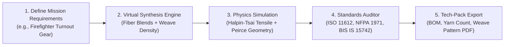

# 🧵 AIMATRY: Materials Informatics & Computational Design for Protective Textiles
## A Practical Guide for Textile Technologists, R&D Managers & Defense Procurement Officers

> **Institution**: Department of Computer Science & Engineering & Textile Technology, NITRA Technical Campus, Ghaziabad  
> **Target Audience**: Textile Scientists, Quality Assurance Managers, Defense Technical Officers, and Mill R&D Teams  
> **Language & Focus**: Textile Engineering Principles, Testing Standards, and Physical Property Optimization  

---

## 🎯 Executive Summary: Why Materials Informatics in Textiles?

In protective technical textiles, every product engineer faces the same fundamental challenge: **conflicting physical properties**.

```
              Thermal Protection (HTP / TPP)
                            ▲
                           ╱ ╲
                          ╱   ╲   (The Classic Trade-off:
  Synthetic Feasibility ◄┼─────┼► Comfort & Breathability (THL)
  & Production Cost       ╲   ╱    Thicker = Warmer but Traps Sweat)
                           ╲ ╱
                            ▼
           Flexibility & Drape ◄───► Tensile Breaking Strength
```

* **The Traditional Method (Trial-and-Error)**:
  1. Formulate a fiber blend (e.g. 65% Nomex / 35% Kevlar).
  2. Spin yarn, weave sample swatches on a sample loom, apply chemical finishes.
  3. Send test coupons to physical testing laboratories (Instron for tensile, Sweating Guarded Hotplate for $R_{et}/R_{ct}$, Cone Calorimeter for LOI/HTP).
  4. If the sample fails ISO 11612 or NFPA 1971, adjust the blend and repeat.
  * ⏱️ **Time**: 4 to 9 months | 💰 **Cost**: ₹5 Lakhs – ₹25 Lakhs per product cycle.

* **The AIMATRY Method (Virtual Formulation & Optimization)**:
  * Uses textile physics equations (Halpin-Tsai composite micromechanics, Peirce weave geometry, and 1D heat transfer diffusion) to simulate and screen **thousands of fiber combinations and weave densities in seconds**.
  * Ranks the best candidates mathematically and exports a complete **Manufacturing Tech-Pack (BOM, Yarn Counts, Weave Style, Compliance Matrix)** before a single meter of yarn is spun.

---

## 🔬 1. How AIMATRY Works in Textile Terms

You don't need a computer science background to use or understand AIMATRY. The system is designed around standard textile parameters:



### Key Textile Principles Computed by the Engine:
1. **Fiber Blend Micromechanics**:
   * Predicts composite yarn breaking tenacity and modulus from constituent fiber properties (Meta-aramid, Para-aramid, PBO/Zylon, FR Viscose, UHMWPE) using Halpin-Tsai equations.
2. **Fabric Weaving Architecture**:
   * Incorporates **Peirce's 2D Circular Yarn Model** to calculate yarn crimp percentage, ends/picks per inch (EPI/PPI), cover factor ($K$), and total fabric areal density ($\text{GSM}$).
   * Evaluates weave structures: **Plain Weave**, **Twill 2/1**, **Ripstop Grid**, and **Satin 4/1**.
3. **Thermal Protection (HTP / TPP)**:
   * Simulates heat flux ($84\,\text{kW/m}^2$, simulating industrial flash-fire or convective flame) moving through the fabric thickness over time using transient heat conduction equations to calculate **time-to-second-degree-burn**.
4. **Physiological Comfort & Total Heat Loss (THL)**:
   * Calculates dry thermal resistance ($R_{ct}$) and water vapor resistance ($R_{et}$) to determine total heat loss per square meter ($\text{W/m}^2$) per **EN ISO 11092** (Sweating Guarded Hotplate standard).
5. **Limiting Oxygen Index (LOI)**:
   * Estimates self-extinguishing behavior based on molecular char-yield chemistry. (Air has 21% $\text{O}_2$; any formulation with $\text{LOI} > 28\%$ is inherently flame retardant).

---

## 📋 2. What Is Currently Built & Functional in the Software

| Module | What It Does for the Textile Specialist | Relevant Textile Standard |
| :--- | :--- | :--- |
| **🔬 Material Designer** | Adjust sliders for target thermal, tensile, breathability, and weight priorities. The system instantly suggests the optimal fiber blend ratio and yarn count. | ISO 13934-1 (Tensile), EN ISO 9151 (HTP) |
| **📜 Regulatory Compliance Auditor** | Automatically checks whether the proposed fabric passes or fails codified standards before lab submission. | **ISO 11612** (Flame)<br>**NFPA 1971** (Fire turnout)<br>**ASTM F1959** (Electric Arc ATPV)<br>**BIS IS 15742** (Indian Thermal)<br>**BIS IS 14324** (Indian Ballistic) |
| **📄 Automated Tech-Pack Generator** | Generates an official 8-section manufacturing PDF specification with Bill of Materials (BOM), required finishes (DWR/fluorocarbon), and testing sequences. | Industrial Mill Standard |
| **🧪 Lab Calibration & Active Learning** | Allows your laboratory to upload real test results (CSV) from Instron or hotplate machines to automatically calibrate the software's accuracy. | ISO 17025 Lab QA Workflow |
| **💬 AI Technical Copilot** | Natural language assistant answering questions on fiber degradation temperatures, chemical resistance, and standard requirements. | Materials Science Knowledge Base |

---

## ⚖️ 3. Complete Honesty: What Is Real vs. What Needs Lab Collaboration

To maintain strict scientific integrity, here is the exact status of the platform:

```
┌─────────────────────────────────────────────────────────────────────────────┐
│ 🟢 FULLY IMPLEMENTED COMPUTATIONAL ENGINES                                  │
├─────────────────────────────────────────────────────────────────────────────┤
│ • Halpin-Tsai Composite Tensile Equations                                  │
│ • Peirce Fabric Weave Geometry & GSM Estimator                              │
│ • 1D Transient Flash-Fire Heat Transfer Conduction                          │
│ • TOPSIS Multi-Criteria Decision Ranking Engine                             │
│ • Pareto Optimization (Trade-off Curve Explorer)                            │
│ • Automated 6-Standard Pass/Fail Rule Auditor                               │
│ • ReportLab Manufacturing Tech-Pack PDF Generation                          │
└─────────────────────────────────────────────────────────────────────────────┘
                                      ▼
┌─────────────────────────────────────────────────────────────────────────────┐
│ 🤝 WHERE WE NEED YOUR LAB EXPERTISE & TEST DATA                             │
├─────────────────────────────────────────────────────────────────────────────┤
│ • Physical Lab Test Data: The software currently uses physics simulations.  │
│   We need physical test logs (from Instron tensile testers, cone            │
│   calorimeters, and sweating hotplates) to fine-tune the calibration.       │
│ • Laundering Degradation: Adding wash-durability curves (25, 50, 100        │
│   industrial wash cycles per ISO 6330).                                     │
│ • Microstructural Parameters: Incorporating X-ray Diffraction (XRD)         │
│   crystal orientation data for ultra-high-tenacity aramid fibers.           │
└─────────────────────────────────────────────────────────────────────────────┘
```

---

## 🤝 4. The Collaborative Vision: AI + NITRA Laboratories

AIMATRY is **not intended to replace the physical testing laboratory**. Physical testing on accredited equipment (Instron, Sweating Hotplate, Cone Calorimeter) is legally mandatory for ISO and BIS certification.

### The True Synergy:
1. **Reduce Physical Iterations**: Instead of weaving and testing 50 candidate fabrics to meet a defense tender, the software screens 1,000 possibilities and identifies the **top 3 optimal formulations**.
2. **Active Learning Loop**: Your lab tests those 3 fabrics. You upload the test results into AIMATRY's **Lab Importer**, and the software learns the exact machine calibration factors for your facility.
3. **Faster Defense & Industrial Turnaround**: Allows Indian manufacturers to design and certify specialized PPE for DRDO, CRPF, Indian Army (Siachen), and Indian Railways in **weeks instead of months**.

---

## ❓ Frequently Asked Questions by Textile Experts

### Q1: "Can the software predict fabric behavior after 50 industrial washes?"
> **Answer**: *"Currently, the software models 5-year calendar thermal/chemical degradation using Arrhenius kinetics. Adding ISO 6330 laundering test curves (tracking LOI, tensile, and water repellency after 25, 50, and 100 wash cycles) is our immediate next phase, which we plan to build directly with your lab testing data."*

### Q2: "How does the system calculate total fabric weight (GSM)?"
> **Answer**: *"Using Peirce's 2D weave geometry: the software calculates yarn diameter from yarn count (English count $N_e$ or Denier), determines ends and picks per inch based on weave tightness, adds warp and weft crimp percentages, and computes the theoretical fabric areal density in grams per square meter ($\text{g/m}^2$)."*

### Q3: "What standards are pre-coded into the auditor?"
> **Answer**: *"Six major Indian and international standards: ISO 11612 (General heat/flame), NFPA 1971 (Structural firefighting), ASTM F1959 (Electric arc flash ATPV), BIS IS 15742 (Indian thermal clothing), BIS IS 14324 (Indian ballistic armor), and EN ISO 11092 (Sweating guarded hotplate comfort)."*
